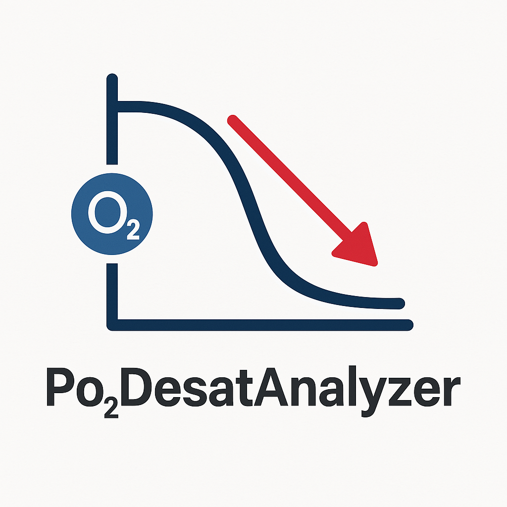

<table width="100%">
  <tr>
    <td align="left" width="20%">
      
    </td>
    <td align="center" width="60%">
      <h1>PO<sub>2</sub> Desaturation Analyzer</h1>
      <em>From signal to insight</em>
    </td>
    <td align="right" width="20%">
      
    </td>
  </tr>
</table>

# PO2DesatAnalyzer
# 🩸 Po₂DesatAnalyzer  A standalone, batch-ready tool for physiological analysis of oxygen desaturations using SpO₂-to-pO₂ conversion and ABOSA-style event detection.

## 🔬 Key Features

- 🧠 Converts SpO₂ signals to estimated pO₂ using the Hill equation
- 📉 Detects desaturation and recovery events (ABOSA-aligned)
- 🧪 Extracts event-wise and global metrics: ODI, DesSev, DesDur, t90, area, slope
- 🛠️ Batch-processes EDF+XML studies with one command
- 📁 Exports cumulative `.csv` for use in Excel, dashboards, or research

## 📦 Requirements

- Python 3.9+
- `numpy`, `scipy`, `pandas`, `matplotlib`, `pyedflib`

## 🚀 Quick Start

```bash
git clone https://github.com/BrettDuce/Po2DesatAnalyzer.git
cd Po2DesatAnalyzer
pip install -r requirements.txt
python run_batch.py --folder "C:/SleepStudies/EDF"
